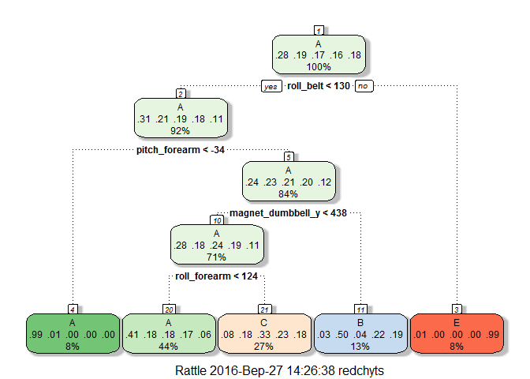
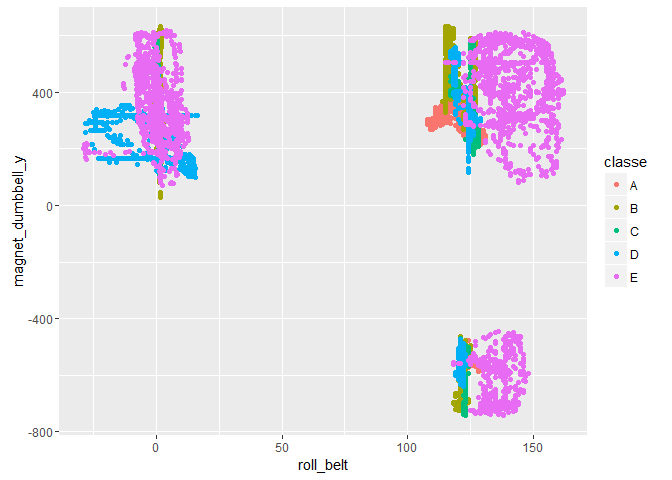

# Coursera Practical Machine Learning Project
Sergiy Redchyts  

**Coursera - Practical Machine Learning:** Peer Assessment Project 

#Executive Summary

The goal of this project is to predict the manner in which people did the exercise. This is the "classe" variable in the training set.

Using devices such as Jawbone Up, Nike FuelBand, and Fitbit it is now possible to collect a large amount of data about personal activity relatively inexpensively. These type of devices are part of the quantified self movement – a group of enthusiasts who take measurements about themselves regularly to improve their health, to find patterns in their behavior, or because they are tech geeks. One thing that people regularly do is quantify how much of a particular activity they do, but they rarely quantify how well they do it. In this project, your goal will be to use data from accelerometers on the belt, forearm, arm, and dumbell of 6 participants. They were asked to perform barbell lifts correctly and incorrectly in 5 different ways. More information is available from the website here: [link](http://groupware.les.inf.puc-rio.br/har) (see the section on the Weight Lifting Exercise Dataset).

#Exploratory data analyses

##Loading Libraries & Data


```r
library(caret)
```

```
## Loading required package: lattice
```

```
## Loading required package: ggplot2
```

```r
library(rattle)
```

```
## Rattle: A free graphical interface for data mining with R.
## Version 4.1.0 Copyright (c) 2006-2015 Togaware Pty Ltd.
## Type 'rattle()' to shake, rattle, and roll your data.
```

```r
library(rpart)
library(rpart.plot)
library(randomForest)
```

```
## randomForest 4.6-12
```

```
## Type rfNews() to see new features/changes/bug fixes.
```

```
## 
## Attaching package: 'randomForest'
```

```
## The following object is masked from 'package:ggplot2':
## 
##     margin
```

```r
library(ggplot2)
```

The training data to be used for this project:
[link](https://d396qusza40orc.cloudfront.net/predmachlearn/pml-training.csv)

The test data to be used for this project:
[link](https://d396qusza40orc.cloudfront.net/predmachlearn/pml-testing.csv)

The data to be used for this project:
[link](http://groupware.les.inf.puc-rio.br/har)

Let's download data from depositories mentioned above and then read data into datasets replacing miscellaneousand empty fields with 'NA':


```r
train_data <- read.csv("pml-training.csv", na.strings = c("NA", "#DIV/0!", ""))
test_data  <- read.csv("pml-testing.csv",  na.strings = c("NA", "#DIV/0!", ""))
```

##Top level data analysis


```r
dim(train_data)
```

```
## [1] 19622   160
```

```r
dim(test_data)
```

```
## [1]  20 160
```

We have **19622** training data sets and **20** clean test data to check our prediction machine.

Let's remove all the variables containing NA values and several variables which are not direcly related to the target variable classe in both data sets:


```r
NA_number = sapply(1:dim(train_data)[2],function(x)sum(is.na(train_data[,x])))
NA_index = which(NA_number>0)
train_data = train_data[,-NA_index]
train_data = train_data[,-c(1:7)]
train_data$classe = factor(train_data$classe)
test_data = test_data[,-NA_index]
test_data = test_data[,-c(1:7)]
```

Let's split the training set into two data sets for cross validation purposes. We randomly subsample 75% of the set for training purposes, while the rest 25% will be used for testing, evaluation and accuracy measurement.


```r
train_index <- createDataPartition(y=train_data$classe, p=0.75,list=F)
train <- train_data[train_index,] 
test <- train_data[-train_index,]  
dim(train)
```

```
## [1] 14718    53
```

```r
dim(test)
```

```
## [1] 4904   53
```

##Modelling

Now let's use **Tree method** and generate random forest tree for these data and build the plot for it:


```r
model1 <- train(classe ~ .,method='rpart',data=train)
fancyRpartPlot(model1$finalModel)
```

<!-- -->


```r
pred1 <- predict(model1,newdata=test)
    res_data <- confusionMatrix(pred1,test$classe)
    res_data$table
```

```
##           Reference
## Prediction    A    B    C    D    E
##          A 1285  393  410  359  123
##          B   20  320   23  138  116
##          C   87  236  422  307  242
##          D    0    0    0    0    0
##          E    3    0    0    0  420
```


```r
res_data$overall[1]
```

```
##  Accuracy 
## 0.4989804
```

From the confusion matrix we can conclude that the accuracy of “0.50” for this model shows “no purity” hence this model is rejected.

So, let's try **Forest Method**. 


```r
model2 <- randomForest(classe~., data=train, method='class')
    pred2 <- predict(model2,test,type='class') 
    qplot(roll_belt, magnet_dumbbell_y, colour=classe, data=train)  
```

<!-- -->

This model provides us with 99% accurancy hence we can choose this model to predict the testing data set.


```r
res_data_mod <- confusionMatrix(pred2,test$classe)
    res_data_mod$table  
```

```
##           Reference
## Prediction    A    B    C    D    E
##          A 1395    3    0    0    0
##          B    0  945    3    0    0
##          C    0    1  852    5    2
##          D    0    0    0  799    0
##          E    0    0    0    0  899
```


```r
res_data_mod$overall[1]
```

```
##  Accuracy 
## 0.9971452
```

##Conclusions

Based on the results obtained by using the Random Forest method let's consider this approach for testing the test data set to submit the final results:


```r
pred3 <-  predict(model2,test_data,type='class')
    set_end <- length(pred3)
    for (i in 1:set_end){
        filename <- paste0("output_id",i,".txt")
        write.table(pred3[i], file=filename, quote=FALSE, row.names=FALSE, col.names=FALSE)
    }
pred3
```

```
##  1  2  3  4  5  6  7  8  9 10 11 12 13 14 15 16 17 18 19 20 
##  B  A  B  A  A  E  D  B  A  A  B  C  B  A  E  E  A  B  B  B 
## Levels: A B C D E
```

```r
dir()
```

```
##  [1] "output_id1.txt"                   "output_id10.txt"                 
##  [3] "output_id11.txt"                  "output_id12.txt"                 
##  [5] "output_id13.txt"                  "output_id14.txt"                 
##  [7] "output_id15.txt"                  "output_id16.txt"                 
##  [9] "output_id17.txt"                  "output_id18.txt"                 
## [11] "output_id19.txt"                  "output_id2.txt"                  
## [13] "output_id20.txt"                  "output_id3.txt"                  
## [15] "output_id4.txt"                   "output_id5.txt"                  
## [17] "output_id6.txt"                   "output_id7.txt"                  
## [19] "output_id8.txt"                   "output_id9.txt"                  
## [21] "pml-testing.csv"                  "pml-training.csv"                
## [23] "Practical Machine Learning.Rmd"   "Practical_Machine_Learning.html" 
## [25] "Practical_Machine_Learning.md"    "Practical_Machine_Learning.Rmd"  
## [27] "Practical_Machine_Learning_files" "Work"
```


